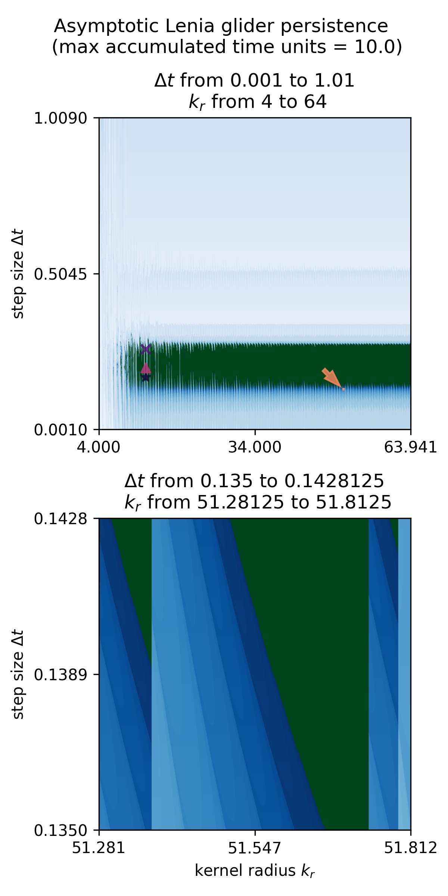

# Exploring the fractal simulosphere in cellular automata

<div align="center">
  
</div>

## Replicating Results and Figures for ALife Submission #131

After following instructions in "Getting Started" below, you can replicate the results for ALife 2024 submission #131 


```
# wide view of asymdrop glider autopoietic competence
python -m fracatal.scripts.mpi_sweep_pt -m fracatal.scripts.mpi_sweep_pt -r 60 -a asymdrop_camera_ready_wide -n asymdrop -g 256 -p 1024 -w 48 -nmu 0.12 -ns 0.005 -ndt 0.001 1.01 -nkr 4 -xkr 64 -ng 0.9 -xg 1.3 -t 10.0 -v 0 -m cpu
    
# zoomed view of asymdrop glider autopoietic competence
python -m fracatal.scripts.mpi_sweep_pt -m fracatal.scripts.mpi_sweep_pt -r 60 -a asymdrop_camera_ready_zoom -n asymdrop -g 256 -p 1024 -w 48 -nmu 0.12 -ns 0.005 -ndt 0.135 0.1428125 -nkr 51.28125 -xkr 51.8125 -ng 0.9 -xg 1.3  -t 10.0 -v 0 -m cpu
```

`alife_2024_131_figures.ipynb` can be used to replicate the figures.

<div align="center">
  
  Figure 1
</div>

<div align="center">
  
  Figure 2
</div>

## Getting started

The main dependencies you'll need are skimage, jax, mpi4py, matplotlib, and their dependencies. `jupyter` and `coverage` are also required for running notebooks and tracking unit test coverage, respectively.

First make sure you have `libopenmpi-dev` and python3 installed on your Linux machine. I am assuming you have a Linux machine: some finagling may be required for setup on windows subsystem for Linux or MacOS.

#### 1. Install system dependencies

```
sudo apt-get update && sudo apt-get install -y libopenmpi-dev python-dev python3-venv 
```

#### 2. Make a virtuale environment

I use `virtualenv` to manage different Python environments, but you may use a different virtual environment manager for python. 

```
virtualenv fracatal --python=python3.8
source fracatal/bin/activate
```

#### 3. Install Python dependencies:

```
pip install -r requirements.txt
pip install -e . 
```

Run tests:

```
python -m tests.test_all
```


## Running experiments with CPU parallelization.

Currently the best way to run an experiment is with fractal/scripts/mpi_sweep.py via the command line. For example:

```
python -m fracatal.scripts.mpi_sweep -r 300 -a experiment_tag -g 256 -p 128 -n orbium_unicaudatus -w 33 -nkr 13.01 -nmu 0.15513 -ns 0.01705 -xs 0.01716 -ndt 0.3065 -xdt 0.3095 -t 10.0 -v 0
```

The cli args for `mpi_sweep` are shown below. 

```
optional arguments:
  -h, --help            show this help message and exit
  -n PATTERN_NAME, --pattern_name PATTERN_NAME
                        the name of the pattern to evaluate, e.g. orbium_unicaudatus. see patterns folder
  -a TAG, --tag TAG     a string tag to help you find your experiments
  -p PARAMETER_STEPS, --parameter_steps PARAMETER_STEPS
                        number of parameter steps to sweep, result will be on a p by p grid
  -r MAX_RUNTIME, --max_runtime MAX_RUNTIME
                        (wall) time limit for experiment. experiments will always (try to) complete at least one run.
  -t MAX_T, --max_t MAX_T
                        maximum accumulated simulation time (in time units)
  -w WORKERS, --workers WORKERS
  -nmu MIN_MU, --min_mu MIN_MU
                        min value for mu (growth/target function peak). if no max_mu is provided, min_mu is used throughout
  -xmu MAX_MU, --max_mu MAX_MU
                        max value for mu (growth/target function peak)
  -ns MIN_SIGMA, --min_sigma MIN_SIGMA
                        min value for sigma (growth/target function bell width). if no max_sigma is provided, min_mu is used throughout
  -xs MAX_SIGMA, --max_sigma MAX_SIGMA
                        max value for sigma
  -ndt MIN_DT, --min_dt MIN_DT
                        min value for simulation time step dt. used throughout if max_dt is not provided.
  -xdt MAX_DT, --max_dt MAX_DT
                        max value for step size dt
  -nkr MIN_KR, --min_kr MIN_KR
                        min value for kernel radius kr. can take float values. min_kr used throughout if max_kr not provided
  -xkr MAX_KR, --max_kr MAX_KR
                        max value for kernel radius kr. can take float values.
  -k0 K0, --k0 K0       native kr value, used to scale glider patterns. currently over-ridden by 13 for Orbium and 31 for Hydrogeminium patterns
  -g GRID_DIM, --grid_dim GRID_DIM
                        grid dimensions for simulation. this must be larger than 2*max_kr+3
  -v VERBOSITY, --verbosity VERBOSITY
                        pass --verbosity 1 to print out debugging info during experiment.

```


# Testing summary

TOTAL                                    1078    859    296     22    18% [coverage.txt](coverage.txt) 
